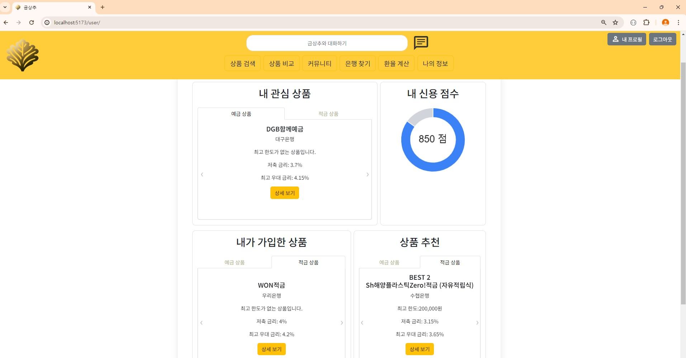

#  GoldenLettuce

### 목차
1. [팀원 정보 및 업무 분담 내역](#팀원-정보-및-업무-분담-내역)
2. [설계 내용 (아키텍처 등) 및 실제 구현 정도](#설계-내용-아키텍처-등-및-실제-구현-정도)
3. [데이터베이스 모델링(ERD)](#데이터베이스-모델링erd)
4. [금융 상품 추천 알고리즘에 대한 기술적 설명](#금융-상품-추천-알고리즘에-대한-기술적-설명)
5. [서비스 대표 기능들에 대한 설명](#서비스-대표-기능들에-대한-설명)
6. [기타(느낀 점, 후기 등)](#기타느낀-점-후기-등)

## 팀원 정보 및 업무 분담 내역
- 프로젝트 기간 : 2024-05-16(목) ~ 2024-05-24(금) (총 9일)
- 팀원 소개  

|이름 | 업무 분담 내역 |
|:---:|---|
|김재훈 (팀장) | 메인 페이지, 환율 계산기, 근처 은행 검색, 커뮤니티, 챗봇|
|복현우| 회원 커스터마이징, 예적금 금리 비교, 프로필 페이지, 금융 상품 추천 알고리즘|

## 설계 내용 (아키텍처 등) 및 실제 구현 정도
### 🖥 기술 스택
**🌕 front**

- language
    - javascript
- framework
    - Vue3
    - pinia (+pinia-plugin-persistedstate)
    - axios
    - chart.js

**🌑 back**

- language
    - python
- framework
    - django
    - django-rest-framework
    - dj-rest-auth
    - pillow
    - drf-spectacular

### 설계 Figma
[**Figma Page**](https://www.figma.com/design/FG6XN7H1FYbf83hR80kszh/%EA%B8%88%EC%83%81%EC%B6%94%2F-%EB%A9%94%EC%9D%B8-%ED%8E%98%EC%9D%B4%EC%A7%80?node-id=0-1&t=agyRrpbWOXtsZU6V-0)
### 기능 구현 정도
- 필수 기능
    - 메인 페이지(서비스 소개, 캐루젤 및 이미지 활용)
    - 회원 커스터마이징(회원관리, 커스텀 User, 이메일, 상품 목록)
    - 예적금 금리 비교(데이터 저장, 전체 조회, 상세 조회, 가입)
    - 환율 계산기(국가 선택, 2가지 입력)
    - 근처 은행 검색(위치와 은행을 선택, 은행 정보 출력)
    - 커뮤니티(게시글 CRUD, 댓글 생성, 삭제)
    - 프로필 페이지(기본 정보 출력, 정보 수정, 가입 상품 리스트, 차트)
    - 금융 상품 추천 알고리즘(1개 이상 상품 추천)
- 추가 기능
    - 예적금 금리 비교(관리자 수정 기능 및 수정 시 가입자 이메일로 변동 알림 메일 전송)
    - 근처 은행 검색(은행 정보 클릭시 해당 은행의 대표 상품 출력)
    - 커뮤니티(대댓글)
    - 챗봇 이용

## 데이터베이스 모델링(ERD)
 

### API 명세서

## 금융 상품 추천 알고리즘에 대한 기술적 설명
1. DB의 회원들의 회원 정보(월 수입, 출생연도, 보유 자산)를 기반으로 현재 추천받는 유저와의 차이를 100점 만점으로 계산
2. 각 상품마다 가입자의 점수 총합 계산. 예.적금 상위 5개 상품을 추천 상품으로 제시

## 서비스 대표 기능들에 대한 설명
### 1️⃣ 메인 페이지
 
 

### 2️⃣ 회원 커스터마이징
 
 

### 3️⃣ 예적금 금리 조회
 
 
 
 
 
 
 
 
 
 
 

### 4️⃣ 환율 계산기
 
 

### 5️⃣ 근처 은행 검색
 
 

### 6️⃣ 커뮤니티
 
 
 
 

### 7️⃣ 프로필 페이지
 
 
 

### 8️⃣ 금융 상품 추천
 
 

### 9️⃣ 챗봇
 

### 🔟

## 기타(느낀 점, 후기 등)
- 김재훈(선장) : 
- 복현우(선원) : 많은 노력을 들인 만큼 많은 것을 얻을 수 있던 프로젝트였습니다. 중요 기능을 비교적 간단히 구현한 경우도 있었고, 별 거 아닌 기능에 많은 시간을 소모한 경우도 있었습니다. 이 모든 일련의 과정들을 잘 제어할 수 있도록 '초기 설계'의 중요성을 다시 한 번 실감할 수 있었습니다. 두 명의 소규모 프로젝트였지만, 진전이 더뎌 초조해지는 순간에도 재훈 형님이 발전시킨 것을 보고 많은 힘을 얻고 다시 달릴 수 있는 동력을 얻을 수 있었습니다. 짧은 시간 동안 많은 필수 요구 사항을 구현해야 하다보니 필수 요구사항에 몇몇 기능을 추가하는 데 그쳤지만, 1학기 동안 배운 것을 총망라하면서 부족했던 부분을 다시 확인하고 애플리케이션을 완성해 가는 재미를 느낄 수 있던 시간이었습니다. 