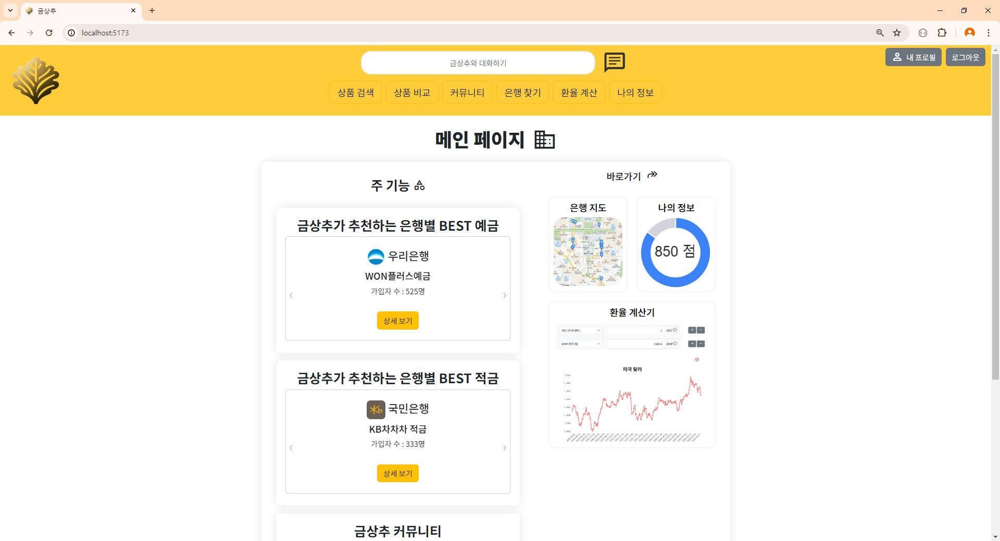
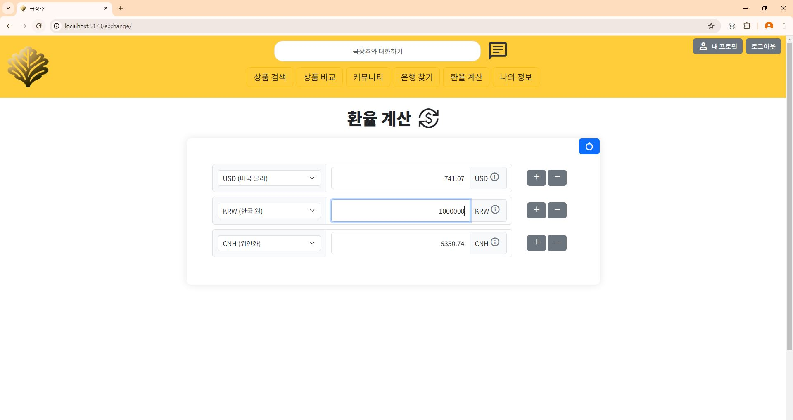

#  GoldenLettuce

### 목차

1. [팀원 정보 및 업무 분담 내역](#팀원-정보-및-업무-분담-내역)
2. [설계 내용 (아키텍처 등) 및 실제 구현 정도](#설계-내용-아키텍처-등-및-실제-구현-정도)
3. [데이터베이스 모델링(ERD)](#데이터베이스-모델링erd)
4. [금융 상품 추천 알고리즘에 대한 기술적 설명](#금융-상품-추천-알고리즘에-대한-기술적-설명)
5. [서비스 대표 기능들에 대한 설명](#서비스-대표-기능들에-대한-설명)
6. [기타(느낀 점, 후기 등)](#기타느낀-점-후기-등)

## 팀원 정보 및 업무 분담 내역

- 프로젝트 기간 : 2024-05-16(목) ~ 2024-05-24(금) (총 9일)
- 팀원 소개

|     이름      | 업무 분담 내역                                                              |
| :-----------: | --------------------------------------------------------------------------- |
| 김재훈 (팀장) | 메인 페이지, 환율 계산기, 근처 은행 검색, 커뮤니티, 챗봇, 서버 구현                    |
|    복현우     | 회원 커스터마이징, 예적금 금리 비교, 프로필 페이지, 금융 상품 추천 알고리즘 |

## 설계 내용 (아키텍처 등) 및 실제 구현 정도

### 🖥 기술 스택

**🌕 front**

- language
  - javascript
- framework
  - Vue3
  - pinia (+pinia-plugin-persistedstate)
  - axios
  - chart.js

**🌑 back**

- language
  - python
- framework
  - django
  - django-rest-framework
  - dj-rest-auth
  - pillow
  - drf-spectacular
 
** server **
- pythonanywhere
- netlify

### 설계 Figma

[**Figma Page**](https://www.figma.com/design/FG6XN7H1FYbf83hR80kszh/%EA%B8%88%EC%83%81%EC%B6%94%2F-%EB%A9%94%EC%9D%B8-%ED%8E%98%EC%9D%B4%EC%A7%80?node-id=0-1&t=agyRrpbWOXtsZU6V-0)

### 기능 구현 정도

- 필수 기능
  - 메인 페이지(서비스 소개, 캐루젤 및 이미지 활용)
  - 회원 커스터마이징(회원관리, 커스텀 User, 이메일, 상품 목록)
  - 예적금 금리 비교(데이터 저장, 전체 조회, 상세 조회, 가입)
  - 환율 계산기(국가 선택, 2가지 입력)
  - 근처 은행 검색(위치와 은행을 선택, 은행 정보 출력)
  - 커뮤니티(게시글 CRUD, 댓글 생성, 삭제)
  - 프로필 페이지(기본 정보 출력, 정보 수정, 가입 상품 리스트, 차트)
  - 금융 상품 추천 알고리즘(1개 이상 상품 추천)
- 추가 기능
  - 비밀번호 수정
  - 예적금 금리 비교(관리자 수정 기능 및 수정 시 가입자 이메일로 변동 알림 메일 전송)
  - 근처 은행 검색(은행 정보 클릭시 해당 은행의 대표 상품 출력)
  - 커뮤니티(대댓글)
  - 챗봇 이용

## 데이터베이스 모델링(ERD)


### API 명세서


<br>


## 금융 상품 추천 알고리즘에 대한 기술적 설명

- 나와 다른 회원 간의 유사성을 이용한 추천 알고리즘
  1. DB의 회원들의 회원 정보(월 수입, 출생연도, 보유 자산)를 기반으로 현재 추천받는 유저와의 차이를 100점 만점으로 계산
  2. 각 필드 도메인의 전체 범위를 분모로 하여 전체 범위 대비 차이간 가중치를 계산하여 곱함(0~1)(차이가 클수록 가중치도 큼)
  3. 세 개의 가중치를 곱한 후 (100-가중치 반영 점수)를 계산
  4. 각 상품마다 가입자의 점수 총합 계산. 예.적금 상위 5개 상품을 추천 상품으로 제시

```python

    for user in users:
        if (user.salary and user.budget) :
            score = 100
            score *= abs(me_year-user.date_of_birth.year)/(max_year-min_year)
            score *= abs(me_salary-user.salary)/(max_salary-min_salary)
            score *= abs(me_budget-user.budget)/(max_budget-min_budget)
            score = 100 - score
            
            for saving in user.join_saving.all():
                scores[saving.id-1][0] += score
```

## 챗봇 프롬프트와 코드

| 내용 |                         이미지                          |
| :--: | :-----------------------------------------------------: |
| 챗봇 |  |
| ERD |  |
| 프롬프트 |  |


```python

conversations = Conversation.objects.all()
previous_prompts = []

if conversations:
    for conversation in conversations:
        previous_prompts.append({"role": 'user', "content": conversation.user_message})
        previous_prompts.append({"role": 'system', "content": conversation.system_message})
        
    print(conversations.count())
    print(previous_prompts)
    
try:
    response = requests.post(
        'https://api.openai.com/v1/chat/completions',
        headers={
            'Authorization': f'Bearer {API_KEY_OPENAI}',
            'Content-Type': 'application/json',
        },
        json={
            'model': 'gpt-4o',
            'messages': [
                {'role': "system", "content": "우리 프로젝트 이름은 금상추야. 너의 이름도 금상추라고 알고 있어줘."},
                {'role': "system", "content": "너는 금상추 프로젝트 서비스에 도움이 되는 유능한 조수야."},
                {'role': 'system', 'content': '유저에게 절대로 장고 프로젝트 동작에 대한 얘기를 하지 마.'},
                {'role': 'system', 'content': '유저가 상품을 추천해달라고 했으면 장고의 예금, 적금 상품 중 fin_prdt_nm에 있는 값을 반환해줘야해.'},
                {'role': 'system', "content": "유저에게 장고 모델의 필드 이름을 직접적으로 말하지 않았으면 해. 필요하다면 필드 이름을 적절하게 한글로 번역해서 알려줘."}
            ] + previous_prompts + [{'role': 'user', 'content': combined_message},
                {'role': 'system', 'content': '유저가 명확하게 답변을 요청하지 않았으면, 명확한 질문을 다시 요청해줘'}],
        }
    )
    response.raise_for_status()
    return response.json()        
```

- 내비게이션 바의 금상추와 대화하기를 누르면 화면 우측에 챗봇이 등장합니다.
- 챗봇은 사용자가 특정 키워드를 입력하는 경우 DB에서 해당하는 상품들을 검색하여 알릴 수 있도록 구현하였습니다.
- 챗봇에는 django 프로젝트의 모델 및 필드 관련 내용을 사전에 프롬프트로 주고, 유저와의 대화 내용을 전부 Conversation이라는 별도의 모델에 저장해서 다음 질문에도 이어지도록 구현했습니다.


## 서비스 대표 기능들에 대한 설명

### 1️⃣ 메인 페이지

|                내용                |                                     이미지                                      |
| :--------------------------------: | :-----------------------------------------------------------------------------: |
|             메인페이지             |              |
| 메인페이지 <br> (개인정보 입력 후) |  |

- 공통적으로 모든 페이지 상, 하단에 내비게이션 바를 구현해서 각 기능으로 이동할 수 있도록 구현하였습니다.
- 메인 페이지에 각 은행별 가입자 수가 가장 많은 상품을 출력해 로그인 하지 않은 사용자도 공통 BEST 상품을 추천받을 수 있습니다.
- 또 주변 은행, 내 상품 정보, 환율 계산기, 커뮤니티를 미리 볼 수 있는 컴포넌트를 구성하였습니다.

### 2️⃣ 회원 커스터마이징

|   내용   |                             이미지                              |
| :------: | :-------------------------------------------------------------: |
| 회원가입 |  |
|  로그인  |      |

- 회원가입 시 비밀번호 8글자 확인, 비밀번호 확인과 일치 여부를 출력하여 사용자가 에러 메시지를 통해 잘못된 부분을 확인할 수 있도록 하였습니다.
- 로그인 실패 시 에러 메시지를 띄워 아이디와 비밀번호를 재확인하도록 하였습니다.

### 3️⃣ 예적금 금리 조회

|       내용       |                                     이미지                                      |
| :--------------: | :-----------------------------------------------------------------------------: |
|   예금상품검색   |          |
|   적금상품검색   |          |
|    예금상세1     |                |
|    예금상세2     |                |
|    예적금수정    |              |
| 예적금수정이메일 |  |
|    적금상세1     |                |
|    적금상세2     |                |
|     예금비교     |                  |
|     적금비교     |                  |
| 은행 상세 페이지 |                          |

- 옵션 선택을 통해 예금, 적금 상품 검색을 진행할 수 있습니다.
- 옵션의 종류로는 저축 기간, 정렬, 은행이 있고 정렬은 라디오 버튼으로 하나의 값을, 저축 기간과 은행은 0개 이상의 값을 선택할 수 있습니다. 하나도 선택하지 없는 경우에는 전체 선택으로 간주하고 검색을 진행합니다.
- 상품 목록에서 각 상품명을 클릭하는 경우 해당 상품의 상세 페이지로 이동할 수 있습니다.
- 예적금 상세 페이지에서 상품 가입과 비교(관심)을 등록 및 해지할 수 있도록 구현하였습니다.
- 비교(관심) 상품으로 등록한 상품은 비교 페이지에서 각 상품간 금리를 비교할 수 있도록 구현하였습니다.
- 비교의 기준이 되는 저축 기간은 사용자가 희망 저축 기간을 입력한 경우 해당 기간이 기본으로 선택되어 있습니다.
- 사용자는 저축 기간을 바꿔가며 금리를 비교할 수 있고, 상품 중 저축 금리, 최고 우대 금리가 가장 높은 것과 가장 낮은 것에 각각 초록과 빨강으로 색상 변화를 줌으로써 시각적으로 최고 금리와 최저 금리를 확인할 수 있도록 하였습니다.
- 은행 상세 페이지에서는 은행의 대표 번호와 담당자, 그리고 해당 은행이 보유한 상품을 확인할 수 있습니다.
- 또, 집 모양의 버튼을 클릭할 경우 해당 은행의 홈페이지로 이동하도록 구현하였습니다.
- 관리자는 해당 상품의 상세 페이지에서 해당 상품의 금리를 변경할 수 있으며, 관리자가 해당 상품의 금리를 변경하는 경우 해당 상품 가입자에게 금리 정보 변경 알림 이메일이 발송되도록 구현하였습니다.

### 4️⃣ 환율 계산기

|         내용          |                              이미지                               |
| :-------------------: | :---------------------------------------------------------------: |
| 환율계산(with 그래프) |    |
|  환율계산(with 다수)  |  |

- 환율 계산 페이지에서는 각각의 통화를 선택하여 환율을 계산할 수 있습니다.
- 또한, 우측 i 버튼을 클릭하여 최근 환율 추세 그래프를 확인할 수 있도록 구현하였습니다.
- 또 추가/삭제 버튼을 통해 한 번에 최대 5개의 통화 간 환율을 비교할 수 있도록 구현하였습니다.

### 5️⃣ 근처 은행 검색

|         내용         |                                 이미지                                  |
| :------------------: | :---------------------------------------------------------------------: |
|      근처 은행       |          |
| 근처 은행(with 상품) |  |

- 근처 은행 검색 페이지에서는 사용자가 입력한 주소, 없다면 삼성화재 대전 연수원 기준 근처 은행을 검색합니다.
- 출력되는 정보로는 해당 지점명, 전화번호, 입력 위치로부터의 거리가 출력됩니다.
- 해당 은행을 클릭하는 경우 해당 은행이 보유한 예.적금 상품 중 가입자 수가 가장 많은 상품이 하나씩 출력되도록 구현하였습니다.
- 해당 상품을 클릭하는 경우 해당 상품의 상세 페이지로 이동합니다.

### 6️⃣ 커뮤니티

|     내용      |                                   이미지                                    |
| :-----------: | :-------------------------------------------------------------------------: |
| 커뮤니티 메인 |              |
|  게시글 생성  |      |
| 댓글, 대댓글  |  |
|  관리자 권한  |  |

- 커뮤니티 메인에는 커뮤니티의 게시글과 해당 게시글의 댓글 수 작성자 작성일을 확인할 수 있도록 구현하였습니다.
- 로그인한 사용자는 자유게시판과 FAQ에 게시글을 생성할 수 있으며, 게시글 작성자는 자신의 게시글을 수정/삭제할 수 있습니다.
- 로그인한 사용자는 자유게시판 게시물에 댓글과 대댓글을 작성할 수 있으며, 댓글과 대댓글의 삭제가 가능합니다.
- 관리자는 FAQ에 댓글을 작성할 수 있고, 공지사항에 게시글을 작성할 수 있도록 구현하였습니다.

### 7️⃣ 프로필 페이지

|       내용       |                                 이미지                                  |
| :--------------: | :---------------------------------------------------------------------: |
|   프로필 메인    |      |
| 프로필 정보 수정 |      |
|  비밀번호 수정   |  |
|   내 정보 메인   |      |

- 프로필 메인 페이지에서는 내 프로필 이미지 등 정보를 확인할 수 있습니다.
- 또한, 가입한 예금/적금 상품의 금리를 차트를 통해 시각적으로 확인할 수 있습니다.
- 프로필 정보 수정 페이지에서는 필수 정보가 아닌 정보들과 생년월일 정보를 수정할 수 있도록 구현하였습니다.
- dj-rest-auth를 활용하여 비밀번호 수정 기능을 구현하였습니다.
- 별도로 내 정보 페이지를 구성하여 본인이 가입하고 관심 있는 상품들과 상품 추천을 받을 수 있도록 구현하였습니다.
- 신용 점수를 입력하는 경우 본인의 신용 점수가 도넛차트 형태로 나타날 수 있도록 구현하였습니다.
- 상품들은 캐루젤을 이용하여 사용자가 클릭할 경우 슬라이드 되도록 하였습니다.

### 8️⃣ 금융 상품 추천

|      내용      |                                 이미지                                  |
| :------------: | :---------------------------------------------------------------------: |
| 상품 추천 로딩 |  |
| 상품 추천 결과 |          |

- 상품 추천을 입력하는 경우 추천 작업 진행중임을 알리기 위해 검색 중을 나타내는 그래픽을 활용하였습니다.
- 상품 추천 결과는 예/적금 5개씩 추천 순위와 함께 제공되도록 구현하였습니다.

### 9️⃣ 챗봇

| 내용 |                         이미지                          |
| :--: | :-----------------------------------------------------: |
| 챗봇 |  |
| ERD |  |
| 프롬프트 |  |


```python

conversations = Conversation.objects.all()
previous_prompts = []

if conversations:
    for conversation in conversations:
        previous_prompts.append({"role": 'user', "content": conversation.user_message})
        previous_prompts.append({"role": 'system', "content": conversation.system_message})
        
    print(conversations.count())
    print(previous_prompts)
    
try:
    response = requests.post(
        'https://api.openai.com/v1/chat/completions',
        headers={
            'Authorization': f'Bearer {API_KEY_OPENAI}',
            'Content-Type': 'application/json',
        },
        json={
            'model': 'gpt-4o',
            'messages': [
                {'role': "system", "content": "우리 프로젝트 이름은 금상추야. 너의 이름도 금상추라고 알고 있어줘."},
                {'role': "system", "content": "너는 금상추 프로젝트 서비스에 도움이 되는 유능한 조수야."},
                {'role': 'system', 'content': '유저에게 절대로 장고 프로젝트 동작에 대한 얘기를 하지 마.'},
                {'role': 'system', 'content': '유저가 상품을 추천해달라고 했으면 장고의 예금, 적금 상품 중 fin_prdt_nm에 있는 값을 반환해줘야해.'},
                {'role': 'system', "content": "유저에게 장고 모델의 필드 이름을 직접적으로 말하지 않았으면 해. 필요하다면 필드 이름을 적절하게 한글로 번역해서 알려줘."}
            ] + previous_prompts + [{'role': 'user', 'content': combined_message},
                {'role': 'system', 'content': '유저가 명확하게 답변을 요청하지 않았으면, 명확한 질문을 다시 요청해줘'}],
        }
    )
    response.raise_for_status()
    return response.json()        
```

- 내비게이션 바의 금상추와 대화하기를 누르면 화면 우측에 챗봇이 등장합니다.
- 챗봇은 사용자가 특정 키워드를 입력하는 경우 DB에서 해당하는 상품들을 검색하여 알릴 수 있도록 구현하였습니다.
- 챗봇에는 django 프로젝트의 모델 및 필드 관련 내용을 사전에 프롬프트로 주고, 유저와의 대화 내용을 전부 Conversation이라는 별도의 모델에 저장해서 다음 질문에도 이어지도록 구현했습니다.

## 기타(느낀 점, 후기 등)

- 김재훈(선장) : 단순히 언어를 배울때보다 훨씬 많은 것을 배울 수 있는 프로젝트였습니다. 정해진 정답을 맞추는 게 아닌 내가 원하는 수준의 결과물을 끌어내기 위해 많은 것을 배우고 또 경험해볼 수 있는 뜻깊은 프로젝트였습니다. 생각했던 것 만큼 거창하게 많은 기능을 구현한건 아니지만, 깊게 집중해서 많은 것을 해볼 수 있었던 것 같습니다. 앞으로도 지금처럼 좋은 팀원들과 함께 즐겁게, 열심히 개발을 하고싶습니다. 
- 복현우(선원) : 많은 노력을 들인 만큼 많은 것을 얻을 수 있던 프로젝트였습니다. 중요 기능을 비교적 간단히 구현한 경우도 있었고, 별 거 아닌 기능에 많은 시간을 소모한 경우도 있었습니다. 이 모든 일련의 과정들을 잘 제어할 수 있도록 '초기 설계'의 중요성을 다시 한 번 실감할 수 있었습니다. 두 명의 소규모 프로젝트였지만, 진전이 더뎌 초조해지는 순간에도 재훈 형님이 발전시킨 것을 보고 많은 힘을 얻고 다시 달릴 수 있는 동력을 얻을 수 있었습니다. 짧은 시간 동안 많은 필수 요구 사항을 구현해야 하다보니 필수 요구사항에 몇몇 기능을 추가하는 데 그쳤지만, 1학기 동안 배운 것을 총망라하면서 부족했던 부분을 다시 확인하고 애플리케이션을 완성해 가는 재미를 느낄 수 있던 시간이었습니다.
